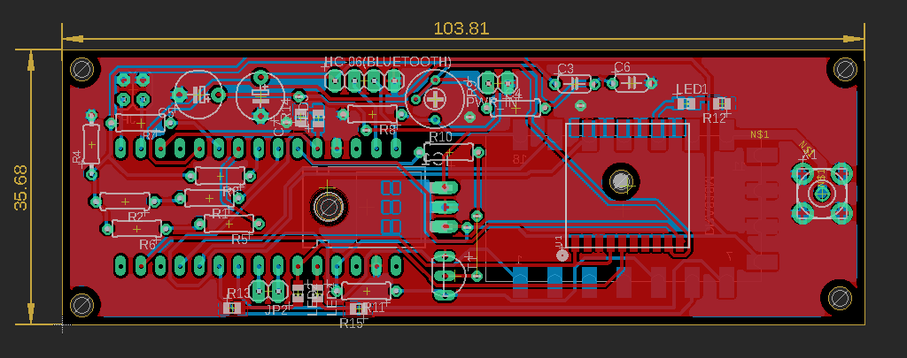

# APRS_tracker

Standalone APRS tracker. This an Arduino-nano powered APRS tracker with a DRA818V 1 W radio module.

## Progress

- Fully functional PCB(v2) - tested up to 11 km in a HAB flight
- Basic full operation was tested with the board externally powered. Refer the test section for details.
- v3: Nearly complete PCB with new GPS module
	- level shifter externally added using a 7404 

### Firmware

-[x] Bug fix for location packets
-[ ] Support for GNSS GPS (Adafruit GPS)

## Testing 

In order to make sure the full functionality the generated APRS packets were tested with [direwolf](https://github.com/wb2osz/direwolf) with a RTL-SDR.
The following command was used to run the iGate

``` rtl_fm -f 144.39M - |direwolf -c sdr.conf -r 24000 -D 1 - ```

- The radio tx frequency commands were tested on a simplex 145.390 M and the standard 144.390 M
- A ground test was carried out on 05/14/23.
	- Device was powered with a external 5V USB power bank for the duration of the test
	- initial GPS lock was completed within 30 s of powering on outside.
	- It was noted that powering indoor and moving to an outdoor location increased the initial GPS lock time significantly.
	- Data collected is available online under the call sign KC3RXZ. a screenshot can be found below. Note that not all the packets were captured by the iGate and the msg_id was used as a counter for how many GPS packets were captured during the test period.Given that the iGate was located indoor and the landscape of the location could account for the lost packets.

APRS ground testing.


### Flight testing

- First HAB flight on 01/10/2023
- call: KE8TJE-11
- data: [aprs.fi](https://aprs.fi/#!mt=roadmap&z=10&call=a%2FKE8TJE-11&timerange=21600&tail=21600)
- comments: The GPS module used worked well up to 11 km of altitude. above that it was unusable
- more information available [here](https://docs.google.com/presentation/d/1fhy-rmdOGR4Q17i7Nnw9TJokxQfwU8tR1A3V_ZNNeEo/edit?usp=sharing) including flight data

## Updates to the PCB

### update: 05/07/23

- [x] Update PCB based on v1.
- know minor issues
	- jumpers on the board need to be larger

### update: October 2023

- updated the GPS module



## Todo list 

- [x] interface GPS sensor
- [x] interface RF
- [x] APRS generation
- [x] get location and update APRS data packet
- [ ] i2c slave module to provide data to master 
- [x] field testing 
- [x] finalized PCB design 
- [x] long range testing at altitude
