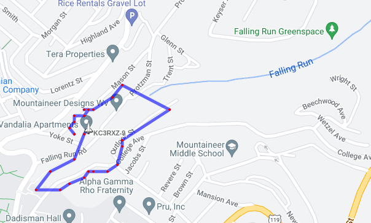
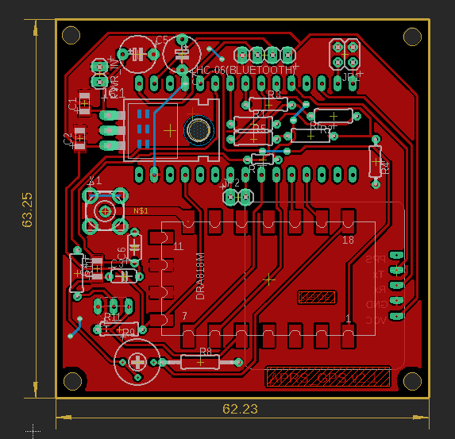

# APRS_tracker

Standalone APRS tracker. This an Arduino-nano powered APRS tracker with a DRA818V 1 W radio module.

## Progress

- Current version of the PCB has a lot of bug and additional connections needed. This will be updated asap (05/14/23)
- Basic full operation was tested with the board externally powered. Refer the test section for details.


## Testing 

In order to make sure the full functionality the generated APRS packets were tested with direwolf with a RTL SDR.
The following command was used to run the iGate

``` rtl_fm -f 144.39M - |direwolf -c sdr.conf -r 24000 -D 1 - ```

- The radio tx frequency commands were tested on a simplex 145.390 M and the standard 144.390 M
- A ground test was carried out on 05/14/23.
	- Device was powered with a external 5V USB power bank for the duration of the test
	- initial GPS lock was completed within 30 s of powering on outside.
	- It was noted that powering indoor and moving to an outdoor location increased the initial GPS lock time significantly.
	- Data collected is available online under the call sign KC3RXZ. a screenshot can be found below. Note that not all the packets were captured by the iGate and the msg_id was used as a counter for how many GPS packets were captured during the test period.Given that the iGate was located indoor and the landscape of the location could account for the lost packets.

APRS ground testing.



## Updates to the PCB

### update: 05/07/23

- [x] Update PCB based on v1.0
- [ ] Testing and building pending. (Innovation Hub WVU)



### update: 14/05/23

- PPT 
- change RX/TX pins to valid pins on the board
- include the standard connector for connection to the daughter board

## Todo list 

- [x] interface GPS sensor
- [x] interface RF
- [x] APRS generation
- [x] get location and update APRS data packet
- [ ] i2c slave module to provide data to master 
- [x] field testing 
- [x] finalized PCB design 

