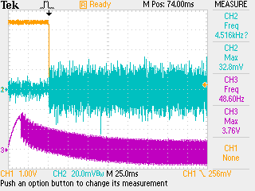
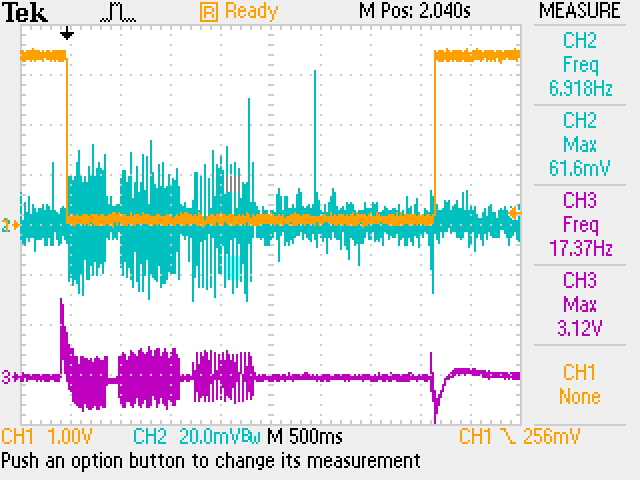

To make this platform capable of using DTMF commands the audio from the radio (DRA818v) needs to be processed. 

### 23/12/2023

- Initial experiments done before failed since the induced RF was too strong to measure the output signal. a VOX base remote transmitting radio was used to isolate the induced RF
- SQL signal was used to trigger the scope.
	
	
	- Yellow -  SQL signal from the radio
	- Blue - Audio output from the radio (1500 Hz tone playing) 
	- Purple - Audio output from FT530 (standard radio)
- DTMF tones - 0,1,3 
	
	
- tones are generated using audacity
- **This was audible using a head phone.** It might work without any modifications

### 24/12/2023

- a gain of 4 on the pre-amp worked out well from lab testing. It would be better to add a pot to have a rage of gain we can tune on the final board 
- use a Attiny84 to send commands to the radio 
- StD pin should be mounted as an interrupt pin on the attiny  

### 25/12/2023

Interface pin list between APRS and DTMF boards
 - 5 v
 - 3.3 v
 - GND x 2
 - Battery in
 - Audio  in 
 - i2c pins - (SCL/SDA)
 - optional x 2 for future use - Potentially to kill the PhaT module after landing
	Total of 10 pins. 5x2 connector specification as shown below
	
	
### 05/01/2024

- Finalized the PCB design and generated outputs compatible with JLC

# 27/01/2024

- Tested tone detection with the attiny 84. 4.7 M resister was replaced on R3 for amplification.
- Indoor testing showed working DTMF decording working on the 1st floor of the building 
### Todo

- [x] Test a schematic for MT8870
- [x] PCB design ✅ 2024-01-05

