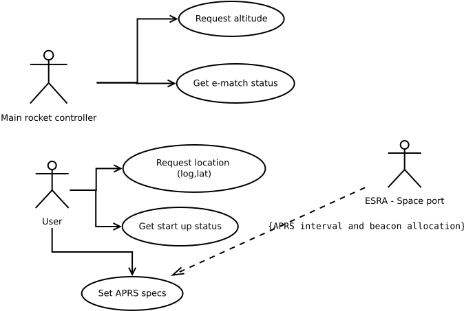
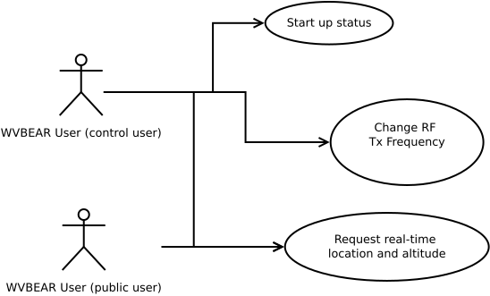
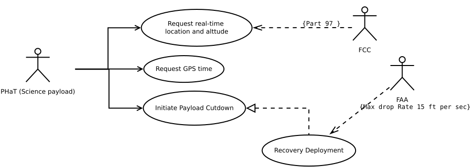
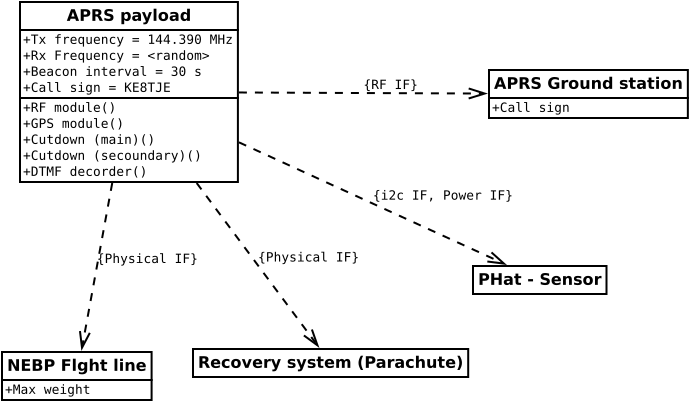

# APRS payload - Concept

 ## Need
- To track rockets during descent and help recovery by identifying the location after landing

## Stake holders
- Rocketry control system 
- FCC 
- Additions due to NEBP
	- NEBP & WVBEAR -  (Added as an alternate user after the initial design)
	- FAA
	- Science Payload (Addition after PAGSO grant acceptance)

---
## Constraints 

- Weight:
	- Based on the specification of NEBP payload design 350 g
- Physical Dimensions:
	- need to be able to fit inside a 3.5 inch rocket. 
	- Have a thermal insulation (High altitude use - NEBP)
- Operational altitude
	- 10 km - from Rocketry
	- 30 km - from NEBP HAB requirements 
- Power -  5v (2s Li-ion/Li-Po)
- Standalone and paired operation modes
- FCC requirements: [47 CFR 97.307(e)](https://www.ecfr.gov/current/title-47/part-97#p-97.307(e))
	- data down link. (uplink added as a Science requirement)

---
# Use case diagram - Rocketry

---
# Use case diagram - NEBP

---

# Use case diagram - NEBP + Science

---
# Logical architecture 

---
## Interface specifications

- RF IF
	- **Data down link:** 144.390 MHz AX 2.5 encoded data stream every 5 mins
		- Have a secondary frequency for high cadence data 
	- **Up link**: some random frequency for each payload using DTMF commands
- i2c IF
	- DTMF and GPS time data will be sent to slave devices
		- Commands:  upto 20 digits can be stored and sent as a single char array. shorter commands can be defined using the `#` as the termination char.
		- GPS time: 3 8 bit integers containing hh,mm,ss in that order
---
## Interface specifications - 2

- Physical IF
	- the payload will be physically connected to the flight line with **Micro code** up to a length of 1 ft.
	- These will be routed through a burn wire
- Power IF
	- 7.4 V Li-Ion cells
	- a shared 5 V regulated supply up to 800 mA

---
# Final system requirements

- The user shall be able to turn on the payload
- The user shall be able to turn off the payload
- The system shall initialize the RF and GPS subsystems
- The system shall provide indicators for GPS lock,RF inputs (via DTMF)
- The system shall send location packets via APRS packets
- The system shall send DTMF, GPS time via i2c to specified slave device connected.
- The system shall burn cutdown wires upon DTMF command
- The system shall burn recovery wire at set altitude